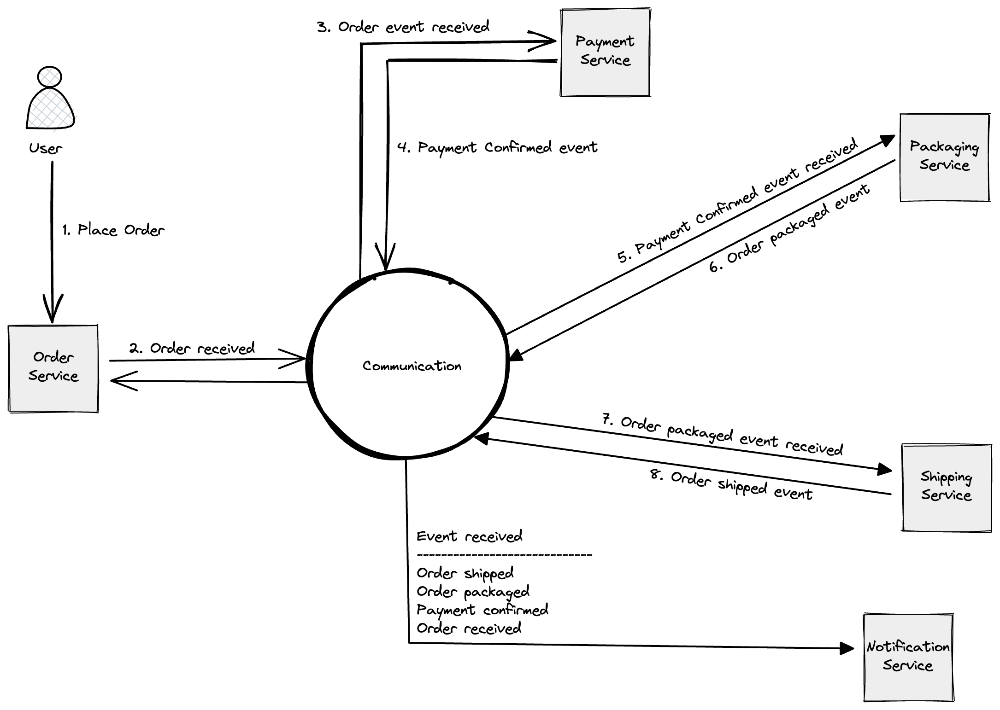

# Microservices Patterns Demo

This repository provides practical examples of the patterns used in microservice architecture. 

The examples are implemented in Kotlin using Spring Boot and Spring Cloud. Example application is a simple online store. It has the following workflow:

## Microservice Architecture

> Microservices - is an architectural style that structures an application as a collection of services that are:
>
> - Independently deployable
> - Loosely coupled
> - Organized around business capabilities
> - Owned by a small team
>
> according to [microservices.io](https://microservices.io/)
